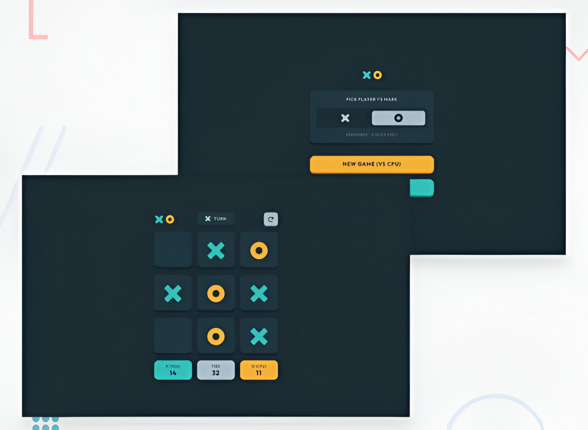
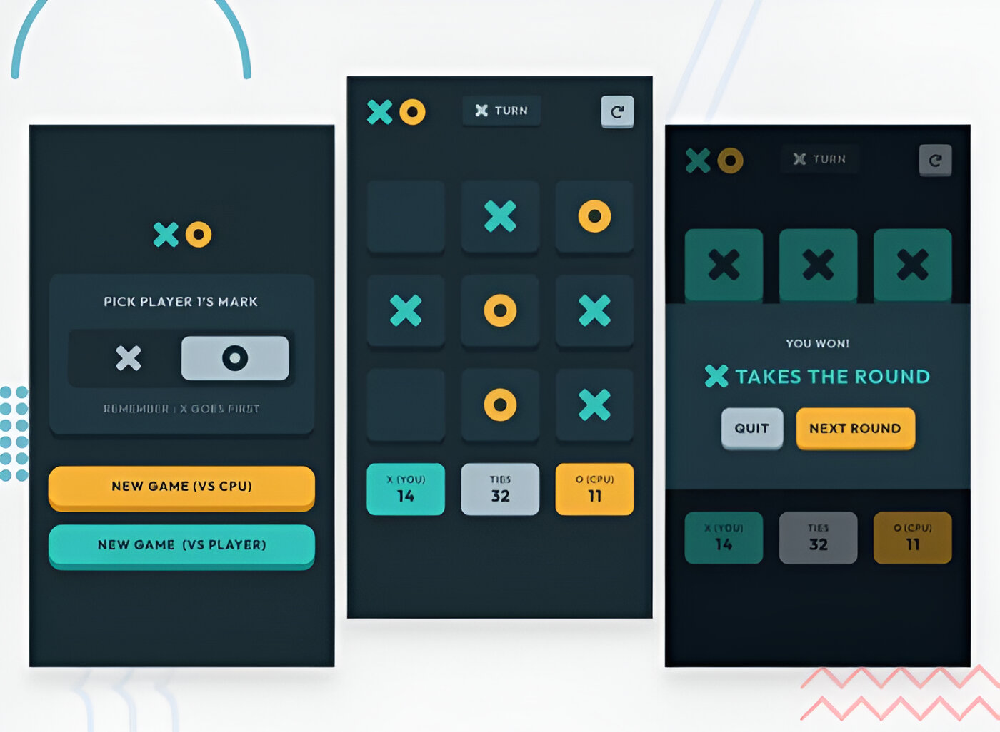

# Tic-Tac-Toe Web Application

This project is a web-based implementation of the classic Tic-Tac-Toe (or XO) game, developed using the React library. The game was created as part of a challenge from [Frontend Mentor](https://www.frontendmentor.io/challenges/tic-tac-toe-game-Re7ZF_E2v). The application offers two modes of play: against the computer (CPU) or against a friend.
 
 

 
 

 
 
<button class="button" style="display: block; border:none; outline: none; background:#1bb673; padding: 10px 40px; font-size: 16px; font-weight: bold; color: white; letter-spacing: 3px; margin: 0 auto;">DEMO</button> 

## Features

- **Two Game Modes**:

  1. **Player vs Computer (AI)**: Choose to play as either X or O, and compete against the computer. The AI opponent is designed to provide a challenging gameplay experience.
  2. **Player vs Player**: Play against a friend, with Player 1 always starting as X.

- **User Interface**:  
  The application consists of two main interfaces:

  1. **Start Screen**:
     - Select your preferred game mode (Player vs Computer or Player vs Player).
     - Choose your symbol (X or O) if playing against the computer.
  2. **Game Board**:
     - The classic 3x3 grid where the game is played.
     - A score tracker that updates after each round.
     - A reset button to clear the score and start fresh.

- **Victory Pop-up**:  
  When a player wins, a pop-up appears announcing the winner, with options to either continue playing or exit the game.

- **Responsive Design**:  
  The game is fully responsive and works seamlessly on different screen sizes, providing an optimal gaming experience on both desktop and mobile devices.

## How to Play

1. **Launch the Application**: Start by choosing either to play against the computer or a friend.
2. **Make Your Moves**: Click on an empty cell in the grid to place your symbol (X or O).
3. **Win the Game**: The first player to align three of their symbols horizontally, vertically, or diagonally wins the game.
4. **View the Results**: After each game, a pop-up will display the winner, and the score will be updated accordingly.
5. **Continue or Reset**: You can choose to play again or reset the scores and start a new session.

## Contributing

Contributions to this project are welcome. If you have suggestions for improvements or new features, feel free to submit a pull request or open an issue.

`created by: Hossam Ghallab :)`
